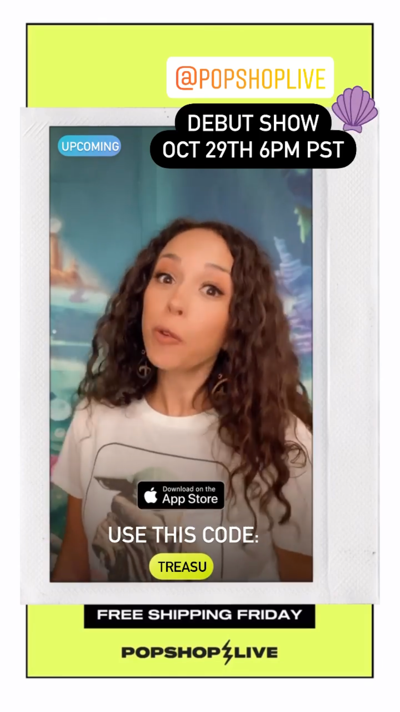
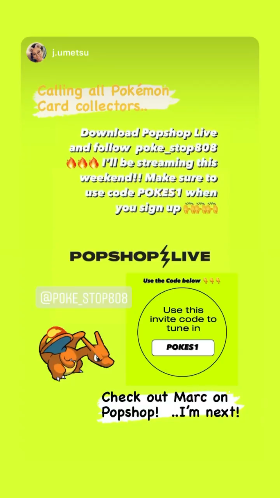

# How do I get referrals? What is my invite code?

Growing your following is the secret to growing your business on Popshop Live. For new sellers, we recommend promoting your store and upcoming shows with existing customers and ask them to follow you on Popshop Live as a simple way to start and build an audience. Sharing your unique referral code is the best way to do this!

&#x20;

**Getting your unique referral code:**

* This 6-digit code can be found in the Popshop Live app. Once shared and a customer enters the code the first time they sign in they will automatically follow you and go right to your store!
* You can find your referral code in your "Store Settings" under "Profile"

* To change your referral code please reach out to your Account Manager

**Share unique code on social media**

* Before you go live, post on your IG story with PSL pre-made templates and mention your code as well as the date and time you're going live.

**Example:**

**** (2).png>)************

_**We’re going live this Thursday at 3:00pm, don’t forget to download the Popshop Live app and use code XXXXXX when signing up so you can follow us and be notified of all of our shows!” → if you share your preview video to IG, it will automatically add your promo to the corner of the screen.**_

**Share your unique code with your friends and family via text**

* Text your family and friends the link to your promo video, we find that friends and family hype sellers up the most which draws a bigger crowd and attention to your shows.

**Example:**&#x20;

_“Hey! I’m going live this Thursday at 3:00pm, don’t forget to tune into my show. I’ll be showing you xxx new items and doing a giveaway. If you’re a new customer, don’t forget to use my code **XXXXXX** during signup.” (Send with preview video attached)_

⚡️_**We recommend continually promoting your store and shows with your audience outside of Popshop, whether on social media (Discord, Facebook groups, Instagram, etc.), email lists, on your website, or by putting a physical sign or merchandising in your physical storefront.**_⚡️

## Related articles

* [New seller marketing playbook](https://jamble.gitbook.io/popshop-live/marketing/marketing-basics/new-seller-marketing-playbook)
* [Popshop Live Logo](https://jamble.gitbook.io/popshop-live/marketing/brand-assets/popshop-live-logo)
* [How can I update or edit my Bank account info?](https://jamble.gitbook.io/popshop-live/payment-and-tax/how-can-i-update-or-edit-my-bank-account-info)
* [Download Disney Social Templates here](https://jamble.gitbook.io/popshop-live/marketing/social-media-marketing/disney-category-social-templates/download-disney-social-templates-here)
* [Download Metaphysical Social Templates here](https://jamble.gitbook.io/popshop-live/marketing/social-media-marketing/metaphysical-category-social-templates/download-metaphysical-social-templates-here)
