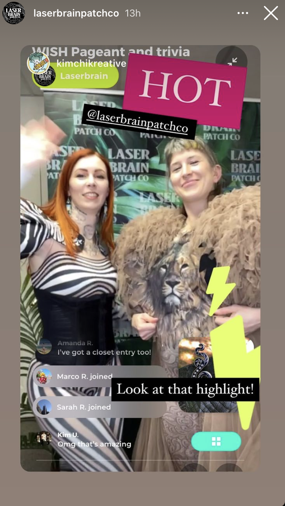
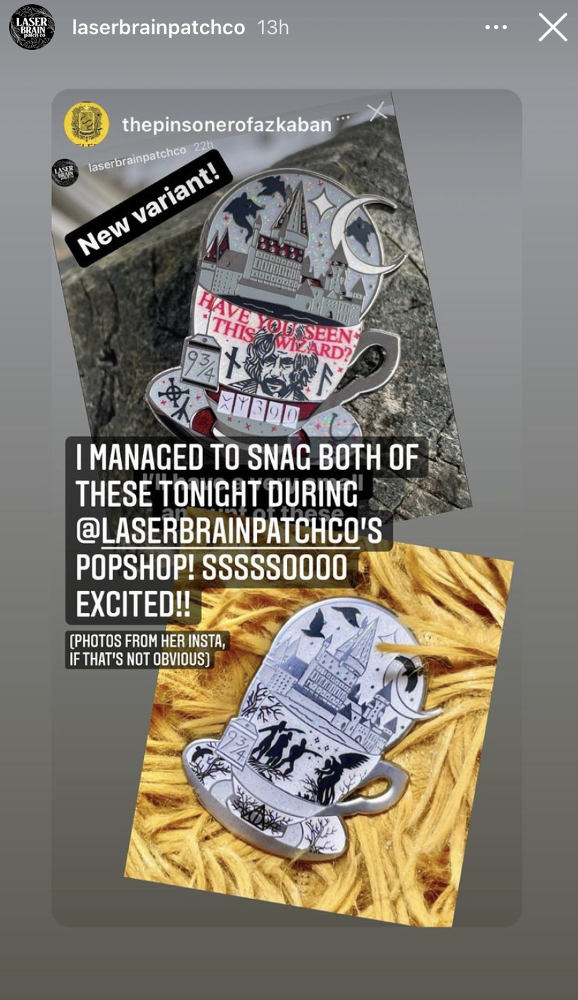

# How do I promote my show on Instagram?

Below, we've gathered a few show promotion techniques used on social media that have greatly increased show awareness and conversion success for our sellers.

### Before The Show

Creating reels with visual references on how to download the app and find your store:

Showcasing a step-by-step Q\&A on your IG story for curious followers and future shoppers:

Uploading a feed post with a clear caption explanation on downloading/finding your store

&#x20;

Adding a dedicated Popshop Live highlight on Instagram:

_Seller: Sparklebombb_

Create a poll to assess what time supporters are interested in watching your stream:

 Seller: Art of PAO

&#x20;

List of detailed instructions on how to download the app or watch live via a shop URL:

Seller: JapanLA

&#x20;

Using countdown features to remind supporters of your upcoming show:

&#x20;

Add flying to your website to let inbound traffic know of your upcoming show

### During The Show

Upload behind-the-scenes stories right before showtime to excite potential shoppers

&#x20;

&#x20;

Broadcast live on Instagram Live showing the behind-the-scenes vibes of your show:

&#x20;

Tweet examples of product giveaways happening during the show to increase FOMO:

### After The Show

Thank shoppers for tuning in, shopping, and supporting the live show experience:

&#x20;

Reposting tagged in-app screen captures and fun show moments:

&#x20;Reposting product purchases from happy shoppers:

Reposting email confirmations from satisfied shoppers:

&#x20;

Postorder status updates to keep shoppers in the loop and encourage product reviews:

## Related articles

* [Popshop Live Logo](https://jamble.gitbook.io/popshop-live/marketing/brand-assets/popshop-live-logo)
