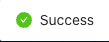

# How can I update or edit my Bank account info?

Updating your banking account or payout information is easily done on your [Seller Dashboard.](https://dashboard.popshop.live/)

1. Head over to [Finances > Payments](https://dashboard.popshop.live/finances/payments) and click on "edit" next to your bank account info

.png>)

2\. A pop-up message will inform you that once this action is done you will not be able to request a payout for 24 hours. Click on "Continue" to update the banking info

3\.  Fill out new banking information with your routing and account numbers, then click on "OK" to finalize the process

4\. If the information is successfully accepted you will see a "success" icon show up at the top of your screen

5\.  From there you will be getting a confirmation email from someone on our team verifying that this change was done by you.

6\.  Be sure to look out for that confirmation email and if you do not see one after 48 hours please email [seller@popshop.live](mailto:seller@popshop.live)

## Related articles

* [What do I need to know about my 1099-K tax form?](https://jamble.gitbook.io/popshop-live/payment-and-tax/what-do-i-need-to-know-about-my-1099-k-tax-form)
* [Can I avoid the shipping cost and pick up my order up at your store?](https://jamble.gitbook.io/popshop-live/shipping-purchases-and-pick-up/fulfillment-and-shipping/can-i-avoid-the-shipping-cost-and-pick-up-my-order-up-at-your-store)
* [Setting up your Seller Profile](https://jamble.gitbook.io/popshop-live/new-seller-on-ramp/setting-up-your-seller-profile)
* [New seller marketing playbook](https://jamble.gitbook.io/popshop-live/marketing/marketing-basics/new-seller-marketing-playbook)
* [Whats New - March 2022](https://jamble.gitbook.io/popshop-live/whats-new-this-month/announcements-2022/whats-new-march-2022)
